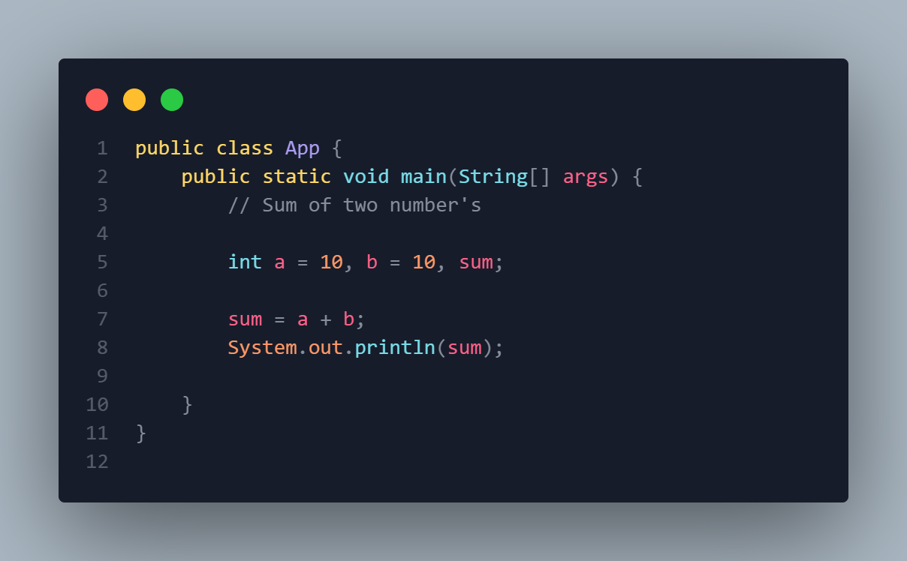
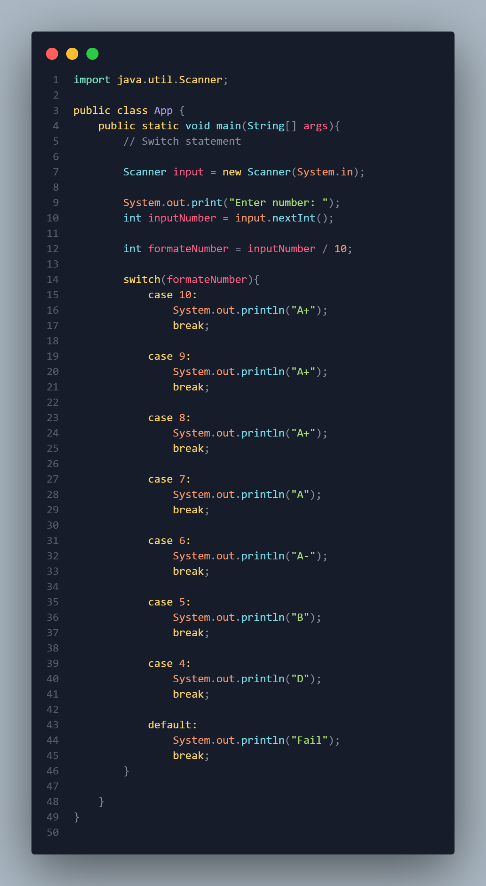
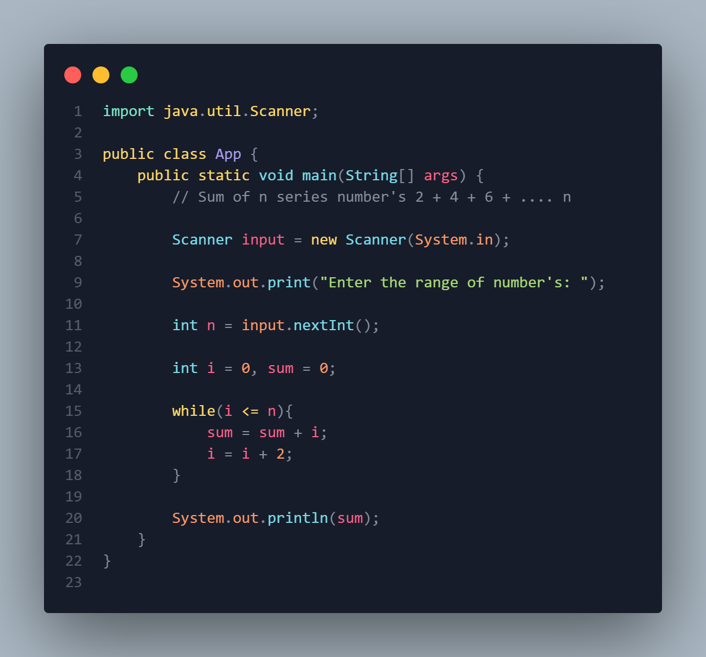
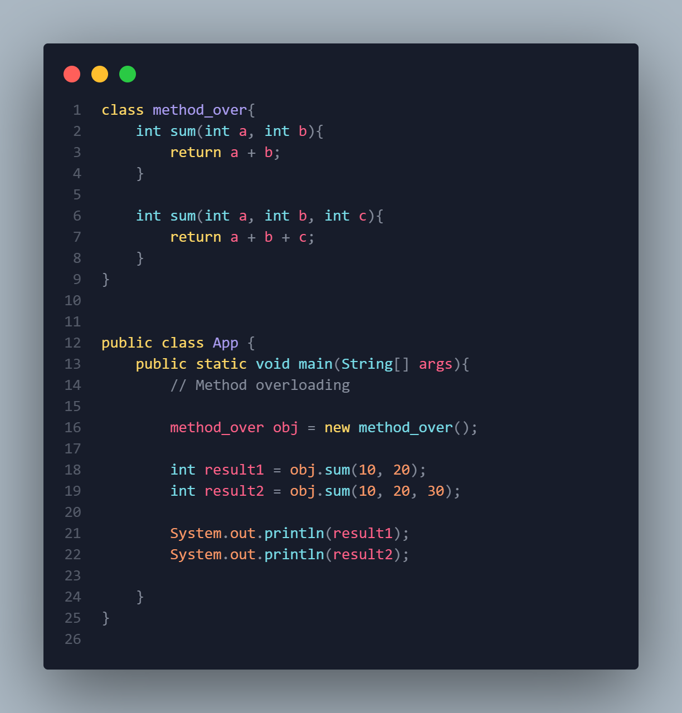
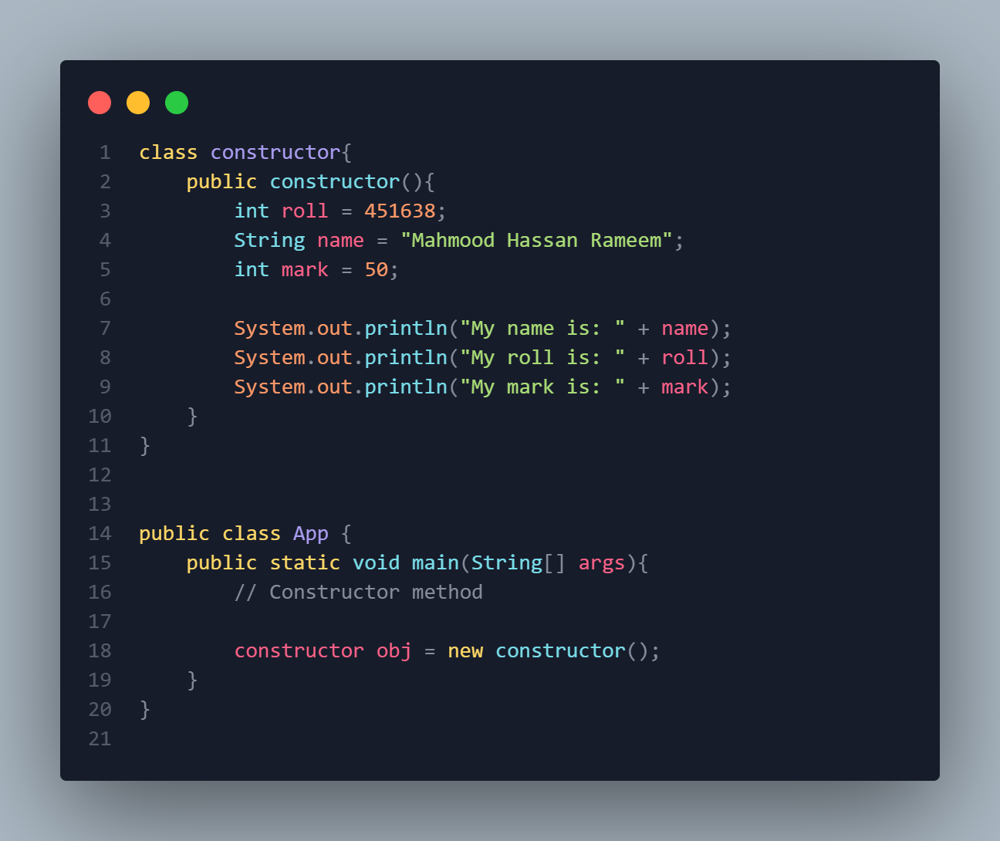
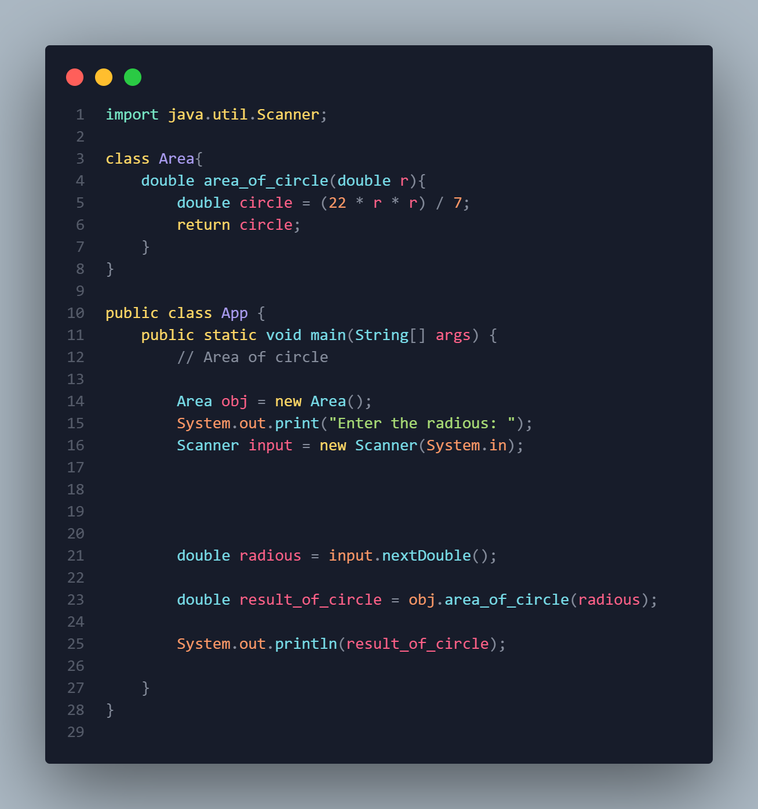
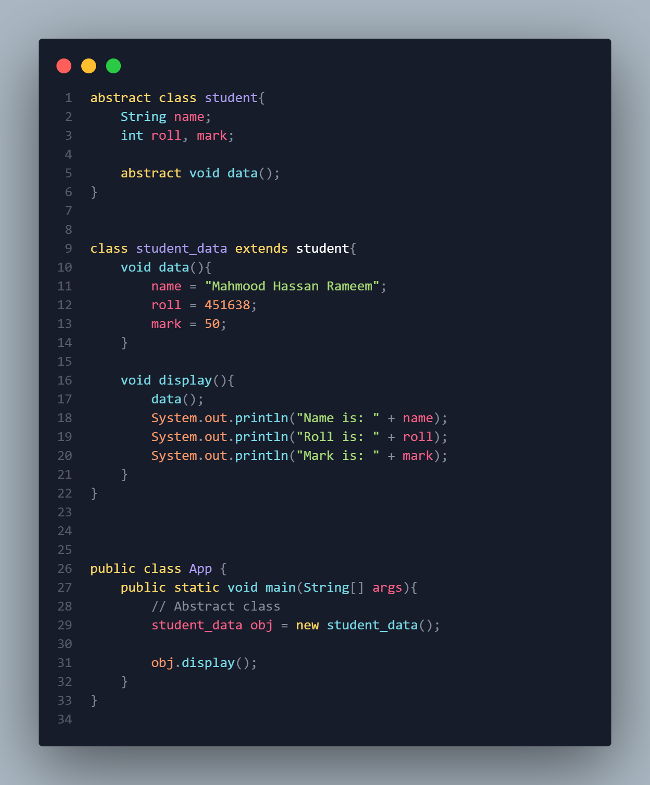

# All JAVA Programmes
## Developer: Mahmood Hassan Rameem
## _Studing Diploma Engineering_
## _Computer Technology_

 
 

# Sum of two number's

 
 

# Switch

 
 

# Sum of 2 + 4 + 6 + ..... N

 
 

# Method overloading

 
 

# COnstructor

 
 

# Area of circle

 
 

# Abstract class
